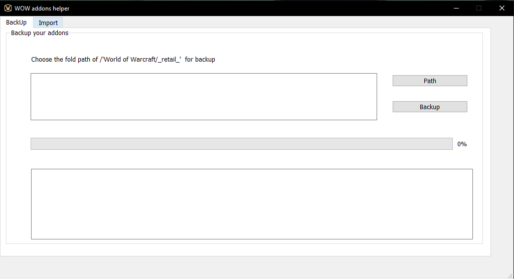

# PythonToolbox
Some useful python tools~

A set of some useful tools based on python which help me solve some little problems. If you enjoy these toolbox, feel free to use them or modify them as you wish, licensed under the [GPL V3](LICENSE)

All the tools based on Python 3.6.5 , you could use general version or use anaconda to create dev environment. Some GUI are based on [PyQt5](https://www.riverbankcomputing.com/software/pyqt/intro).

### WOW addons helper
[Wow addons helper](wow-addons-helper) is a tools that could backup your [World of Warcraft](https://wow.blizzard.cn/landing) addons and setting profiles, which you can easily import your addons and setting profile on another computer.

    

