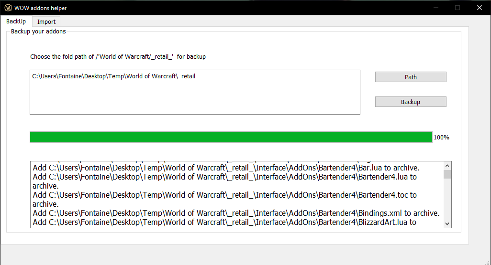
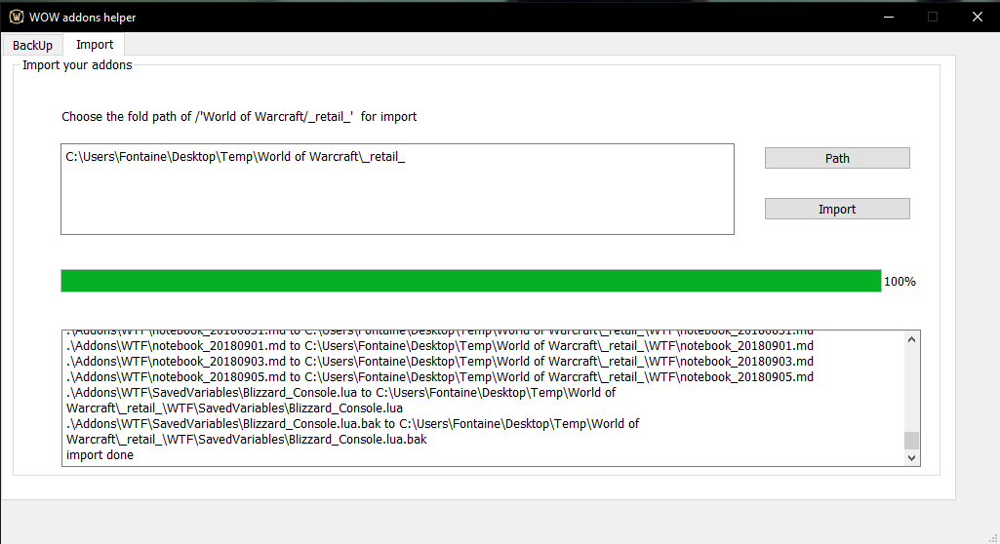

## WOW addons helper/魔兽世界插件助手
**WOW addons helper** is a tools that could backup your [World of warcraft](https://wow.blizzard.cn/landing) addons and setting profiles, which you can easily import your addons and setting profiles on another computer.

魔兽世界插件助手，可以方便的协助玩家手动统一备份自己的插件与画面、插件设置，并快速的备份至另外的电脑上

## Why created this tools?/为什么制作这款工具？
Many [World of warcraft](https://wow.blizzard.cn/landing) players may have multiple ways to download or update their addons.Some addons toolbox such as [Twitch](https://www.twitch.tv) or [Bigfoot](http://bigfoot.178.com/wow/) provide setting sync service but these service need accounts and desktop applications support which means you may need download many addons toolbox and login different accounts on another PC to sync your addons or setting profiles. So I made this tools to bakcup addons and seeting, which import them to a zip file, and then use this tool to unzip this zip file and import all the addons and setting to a WOW install location on new computer.This tools don't need any accounts or any other addons toolbox.

许多魔兽世界的玩家可能从多个渠道下载更新他们的插件。一些插件集合如Twitch或者大脚虽然提供了插件与设置的同步功能，但这些功能都基于其账户与桌面软件，这意味着玩家可能需要使用多个账户和软件才能在另外一台电脑上同步自己的插件与设置。所以我制作了这个工具来备份插件与设置，能将这些文件打包在一个zip中，然后使用这个工具与这个备份的zip文件快速的在新电脑的魔兽世界文件夹上还原插件设置。这个工具不再需要账户或者多个插件工具.

## How to used them?/如何使用？
+ backup/备份
  1. select the Backup tab and then click __Path__ button to chose the "World of Warcraft/\_retail\_"  path.
    选择Backup选项卡，并点击Path按钮选择你的"World of Warcraft/\_retail\_"路径。
  2. click __Backup__ button, the backup process will start
    点击Backup按钮，然后备份流程开始
  3. tool will generate a zip file called Addons.zip as the backup file in the root where this tool is.
     工具会在自身所在的目录下生成一个Addons.zip的文件作为插件与插件设置的备份

    

---
+ import/导入
  1. copy the tool and the generated Addons.zip in the same location on another computer.
     将工具与生成的Addons.zip拷贝至另外一台电脑的同一位置
  2. select Import tab and then click __Path__ button to  chose the" World of Warcraft/\_retail\_"  path.
     选择Import选项卡，并点击Path按钮选择你的"World of Warcraft/\_retail\_"路径。
  3. click __Import__ button to start import process
     点击Import按钮开始导入流程

    

### Screenshoot/截图

    

### License
licensed under the [GPL V3](LICENSE)